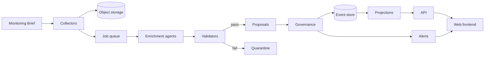

# 02. Architecture

## Principles

1. Strata and Infora share one design system. Build it as a package that each flavour can use.
2. If the Infora source is available, extract the design system from it. If not, build it from the audit.
3. Use the Infora frontend stack from /audit/stack.md.
4. Use the defaults below only where the audit does not show the Infora choice.
5. Use containers for all services, so that Strata can run on any cloud.
6. Use the current stable version of each dependency. Pin each version in the lock file.

## Default stack

| Area | Default |
|---|---|
| Repository | pnpm workspaces with Turborepo |
| Frontend | React with TypeScript and Vite |
| Panel layout | react-grid-layout |
| Map | MapLibre GL JS |
| API | Python with FastAPI and Pydantic |
| Workers and schedules | Python with Procrastinate, a job queue in PostgreSQL |
| Database | PostgreSQL with PostGIS, pgvector and pg_trgm |
| Document storage | S3 compatible object storage. Use MinIO locally |
| AI models | Anthropic API through ANTHROPIC_API_KEY. Keep model names in configuration |
| Identity | OIDC. Use Keycloak locally |
| Live updates | The Infora protocol from the audit. Use Server Sent Events if the audit shows none |
| Telemetry | OpenTelemetry and structured JSON logs |
| Local run | Docker Compose |

## Repository layout

```
strata/
  apps/
    web/                 Strata frontend
  packages/
    design-system/       Tokens and components shared with Infora
    panel-framework/     Grid, panel frame, layout storage
    api-client/          Typed client made from the OpenAPI schema
  services/
    api/                 FastAPI application
    collectors/          RSS, web and PDF collectors
    enrichment/          Agents, validators and evaluation
    governance/          Proposals, approvals, event writer
    projections/         Read models built from events
  config/
    monitoring-brief/    Brief versions as YAML
    taxonomy/            Sectors, geographies, deal types, predicates
    stages.yaml
    tiers.yaml
    approval-policy.yaml
    models.yaml
  prompts/               Versioned prompt files
  db/migrations/
  tests/
    fixtures/
    eval/
    e2e/
  docs/
```

## Service flow



## Completion criteria

1. `docker compose up` starts all services from a clean clone.
2. One command loads the fixture data.
3. CI runs the frontend tests, the Python tests, the linters and a gitleaks scan on each pull request.
4. The README gives the setup for a new developer in ten steps or fewer.
5. The API publishes an OpenAPI schema, and CI builds the typed client from it.
